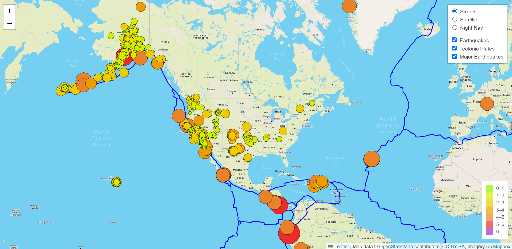
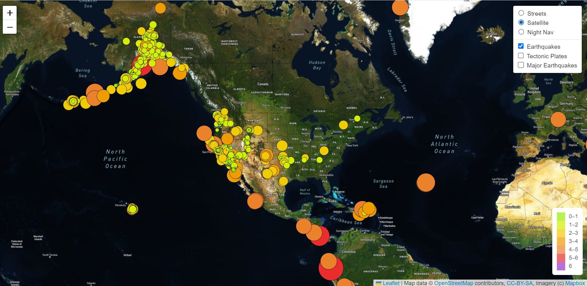
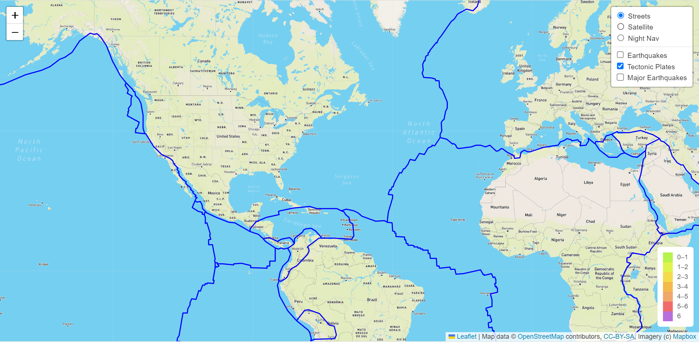
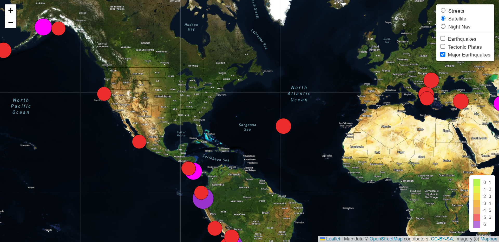

# Mapping_Earthquakes

## Purpose
Use the Leaflet.js Application Programming Interface (API) to populate a geographical map with GeoJSON earthquake data from a URL. Each earthquake is visually represented by a circle and color, where a higher magnitude will have a larger diameter and will be darker in color. In addition, each earthquake has a popup marker that, when clicked, will show the magnitude of the earthquake and the location of the earthquake.

### Street View with All Layers
This map displays all earthqueakes, major earthquakes, and tectonic plates in the street view map.

### Satellite View with Earthquakes
This map displays all earthquake data in the satellite view map.

### Tectonic Plates
This map displays the tectonic plates in the street view map.

### Major Earthquakes
This map displays the major earthquakes in the satellite view map.

### Night Navigation Map
This map displays all earthquakes, major earthquakes, and tectonic plates in the night navigation map.

